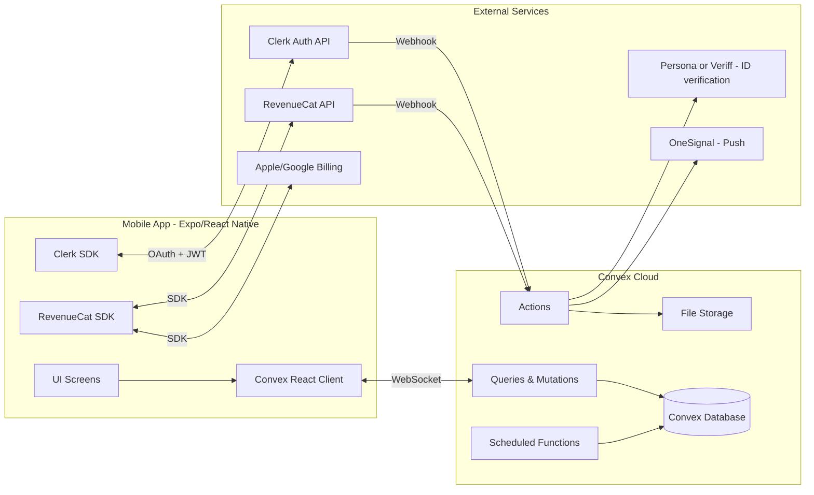

# PRD — Amoura

## 1. Overview

### Product Summary

**Amoura** is a trans-first mobile dating app where trans women and their community find real connection, not fetishization. The product centers trans women and the T4T community (trans men, non-binary, and gender-diverse folks) at its cultural core, and welcomes respectful cis men and cis queer women as guests. The core experience is a Hinge-style prompt-and-match flow where every conversation begins by liking and commenting on a specific prompt or photo — generic swipes and "hey"s are architecturally impossible.

### Objective

This PRD covers the Balanced MVP scope defined in `docs/product-vision.md` § 3 (Product Strategy). The MVP is buildable in 8–10 weeks by a solo founder using Claude Code. It includes identity-first profiles, prompt-and-match messaging, respect-pledge onboarding (with an extended flow for cis users), photo and ID verification, block/report tooling with bad-actor pattern detection, audio prompts, real-time messaging, and a freemium subscription tier.

### Market Differentiation

Three stacked technical commitments drive the differentiation. **Trans-first by design** means identity fields (pronouns, gender, orientation, T4T preference) are first-class schema entities, surfaced prominently in UI, never bolted-on. **Built with, not for** means paid trans advisors are release-gate reviewers — the build process has human review steps, not just automated checks. **Architecturally hostile to fetishization** means the messaging system cannot produce generic openers: every conversation opener is a `Like` entity with a required `comment` field tied to a specific `ProfilePrompt` or `Photo`. These are systems-level commitments, not feature flags.

### Magic Moment

Three magic moments layered together (per vision doc):

1. **First real conversation** (trans user): A user receives a like-with-comment that engages a specific prompt answer — not their body. This requires the prompt-like-comment mechanic to work seamlessly and for there to be enough active density in the user's city to produce a real conversation within their first 48 hours.
2. **Scroll that feels like home** (any core user): First app-open experience shows profiles that are majority-trans in the user's city. Requires city-gated rollout so density is real before launch.
3. **Respect pledge** (cis user): Cis user goes through a 2–3 minute extended respect flow as part of onboarding, completes a meaningful pledge, and enters the app with clear guest framing. Requires high-quality pledge copy and reliable pledge-gating of interaction surfaces.

### Success Criteria

- Time from app-open to first like-with-comment sent: under 5 minutes on first session.
- Time from app-open to first reply received: under 48 hours median (density-dependent; fallback is pre-seeded prompts from community advisors).
- Cis user respect-pledge completion rate: ≥ 70%.
- Percent of conversation-opening messages sent via prompt-comment mechanic: **100% by design** (the API does not accept any other form).
- Reports per 1,000 conversations in month 3: < 10.
- App Store rating after 500 reviews: ≥ 4.5.
- All P0 functional requirements functional with smoke-test coverage.
- WCAG 2.1 AA verified on all MVP screens before launch.

---

## 2. Technical Architecture

### Architecture Overview



### Chosen Stack

| Layer | Choice | Rationale |
|---|---|---|
| Frontend | Expo (React Native) | Single TypeScript codebase for iOS + Android, mature ecosystem, EAS Build handles App Store and Play Store deployment, excellent Claude Code support. |
| Backend | Convex | Real-time reactivity (perfect for chat and matches), TypeScript end-to-end with Expo, built-in file storage, ACID transactions, zero boilerplate. |
| Database | Convex Database | Included with Convex backend; document-relational with automatic indexing and reactive queries. |
| Auth | Clerk | Best mobile auth UX, Apple/Google OAuth out of the box, email magic links, phone auth, solid React Native SDK. Integrates cleanly with Convex via JWT. |
| Payments | RevenueCat | Standard for mobile subscriptions; abstracts Apple StoreKit and Google Play Billing into one SDK. Handles receipts, entitlements, paywalls. Free tier covers launch. |

### Stack Integration Guide

**Install and configure in this order** — each step depends on the previous.

1. **Scaffold the Expo project.** `npx create-expo-app amoura --template` with TypeScript. Enable the new architecture (`"newArchEnabled": true` in `app.json`). Install `expo-router` for file-based routing.

2. **Install Convex.** `npm install convex`. Run `npx convex dev` to create a project. Configure `convex/_generated/` as gitignored. Add `EXPO_PUBLIC_CONVEX_URL` to `.env`.

3. **Install Clerk.** `npm install @clerk/clerk-expo`. Create a Clerk application. Enable **Apple**, **Google**, and **Email Magic Link** as sign-in strategies. Configure redirect URIs for the Expo dev client scheme. Add `EXPO_PUBLIC_CLERK_PUBLISHABLE_KEY` to `.env`.

4. **Wire Clerk into Convex.** Configure Convex to accept Clerk JWTs: add the Clerk JWT template (following Convex docs for Clerk), set `CLERK_JWT_ISSUER_DOMAIN` in Convex env. In `convex/auth.config.ts`, add the issuer domain with application id `"convex"`. Use `ConvexProviderWithClerk` in the Expo app root.

5. **Create a Clerk → Convex user sync webhook.** Use a Convex HTTP action (`convex/http.ts`) that receives `user.created` and `user.updated` events from Clerk and writes to the `users` table. This keeps Convex's user records in sync with Clerk's.

6. **Install RevenueCat.** `npm install react-native-purchases`. Create a RevenueCat project. Configure App Store Connect and Google Play Console products (see § 11). Add `EXPO_PUBLIC_REVENUECAT_APPLE_API_KEY` and `EXPO_PUBLIC_REVENUECAT_GOOGLE_API_KEY` to `.env`. Create a RevenueCat → Convex webhook at `convex/http.ts` for subscription state changes.

7. **Install supporting libraries.** `npm install react-hook-form zod @hookform/resolvers expo-image-picker expo-av expo-haptics @tanstack/react-query nativewind@4` (nativewind for Tailwind-in-RN). For state, Convex's reactive queries replace most client-side state — avoid adding Redux or Zustand unless needed for local UI state.

8. **Configure Tailwind (via NativeWind).** Use the design tokens from `docs/product-vision.md` § 5 (Design Direction). See § 9 of this PRD for the full `tailwind.config.ts`.

**Known gotchas:**
- Convex + Clerk: make sure the `ConvexProviderWithClerk` wraps the Expo `<Slot />` — not the other way around.
- RevenueCat on iOS simulator: in-app purchases do not work on simulator. Use a TestFlight build on a physical device for subscription testing.
- Expo Go does not support RevenueCat or many native modules. Use `expo-dev-client` from the start.
- Convex file storage URLs are pre-signed and expire; re-fetch URLs on every app open via query rather than caching.

**Required environment variables:**
```
EXPO_PUBLIC_CONVEX_URL=
EXPO_PUBLIC_CLERK_PUBLISHABLE_KEY=
EXPO_PUBLIC_REVENUECAT_APPLE_API_KEY=
EXPO_PUBLIC_REVENUECAT_GOOGLE_API_KEY=
EXPO_PUBLIC_ONESIGNAL_APP_ID=

# Convex-side (set with npx convex env set)
CLERK_WEBHOOK_SECRET=
REVENUECAT_WEBHOOK_SECRET=
PERSONA_API_KEY=
ONESIGNAL_API_KEY=
```

### Repository Structure

```
amoura/
├── app/                              # Expo Router — file-based routing
│   ├── (auth)/                       # Public routes: sign-in, sign-up
│   │   ├── sign-in.tsx
│   │   ├── sign-up.tsx
│   │   └── _layout.tsx
│   ├── (onboarding)/                 # Gated after sign-in, before main app
│   │   ├── identity.tsx              # Pronouns, gender, orientation
│   │   ├── photos.tsx                # Photo upload + verification
│   │   ├── prompts.tsx               # Choose 3 prompts and answer
│   │   ├── intentions.tsx            # Dating / hookup / serious / friendship
│   │   ├── respect-pledge.tsx        # Standard pledge (all users)
│   │   ├── respect-pledge-cis.tsx    # Extended pledge (cis users only)
│   │   └── _layout.tsx
│   ├── (tabs)/                       # Main app (post-onboarding)
│   │   ├── browse.tsx                # Browse profiles
│   │   ├── likes.tsx                 # Who liked you
│   │   ├── matches.tsx               # Chats
│   │   ├── profile.tsx               # Your profile
│   │   └── _layout.tsx
│   ├── chat/[matchId].tsx            # Chat screen
│   ├── profile/[userId].tsx          # Viewing another user's profile
│   ├── settings/                     # Account, verification, subscription, help
│   ├── _layout.tsx                   # Root layout with providers
│   └── +not-found.tsx
├── src/
│   ├── components/
│   │   ├── ui/                       # Design system primitives
│   │   │   ├── Button.tsx
│   │   │   ├── Input.tsx
│   │   │   ├── Card.tsx
│   │   │   ├── IdentityChip.tsx      # Pronoun / identity display chip
│   │   │   ├── PromptCard.tsx
│   │   │   ├── PhotoTile.tsx
│   │   │   └── ...
│   │   ├── features/
│   │   │   ├── profile/
│   │   │   ├── browse/
│   │   │   ├── chat/
│   │   │   ├── onboarding/
│   │   │   └── report/
│   ├── lib/
│   │   ├── convex.ts                 # Convex client provider
│   │   ├── clerk.ts                  # Clerk provider config
│   │   ├── revenueCat.ts             # RevenueCat initialization
│   │   ├── haptics.ts                # Haptic helpers
│   │   ├── analytics.ts              # Analytics wrapper
│   │   ├── validation/               # Zod schemas
│   │   └── utils/
│   ├── theme/
│   │   ├── colors.ts
│   │   ├── typography.ts
│   │   └── spacing.ts
│   └── types/                        # Shared TS types
├── convex/
│   ├── schema.ts                     # Database schema
│   ├── auth.config.ts                # Clerk JWT issuer config
│   ├── http.ts                       # HTTP actions (webhooks)
│   ├── users.ts                      # User queries/mutations
│   ├── profiles.ts                   # Profile queries/mutations
│   ├── photos.ts                     # Photo upload, verification
│   ├── prompts.ts                    # Prompt list, rotation
│   ├── likes.ts                      # Create like with comment
│   ├── matches.ts                    # Match creation, list
│   ├── messages.ts                   # Chat messages
│   ├── reports.ts                    # Report submission, admin review
│   ├── verifications.ts              # Photo/ID verification
│   ├── subscriptions.ts              # RevenueCat state sync
│   ├── blocks.ts                     # Block/unblock
│   ├── moderation.ts                 # Bad-actor pattern detection
│   ├── notifications.ts              # Push notification triggers
│   ├── crons.ts                      # Scheduled jobs
│   └── lib/                          # Shared backend helpers
├── assets/
│   ├── fonts/                        # Fraunces, Inter, JetBrains Mono
│   └── images/
├── app.json                          # Expo config
├── eas.json                          # EAS Build config
├── tailwind.config.ts
├── metro.config.js
├── package.json
└── tsconfig.json
```

### Infrastructure & Deployment

- **Expo + EAS Build.** Build iOS and Android binaries via EAS Build. Use `eas.json` profiles: `development` (dev client), `preview` (internal testing), `production` (App Store / Play Store).
- **Convex Cloud.** Convex hosts the backend, database, file storage, and cron jobs. Deploy via `npx convex deploy` from CI or local.
- **TestFlight** for iOS beta distribution; **Google Play Internal Testing** for Android.
- **Clerk Cloud** is the auth provider — no self-hosting.
- **RevenueCat Cloud** for billing dashboards and webhooks.
- **Persona** or **Veriff** for ID verification (integrated via Convex action).
- **OneSignal** for push notifications (free up to 10K subscribers).
- **CI/CD:** GitHub Actions. On push to `main`: run TypeScript checks, lint, Convex deploy to production. On push to `develop`: Convex deploy to dev environment. EAS Build triggered manually or on release tags.

### Security Considerations

- **Auth:** Clerk manages sessions with short-lived access tokens (1 hr) and refresh tokens (30 days). All Convex queries/mutations check `ctx.auth.getUserIdentity()` and reject unauthenticated requests.
- **Authorization:** Every query and mutation verifies the caller is the owner of the resource or has explicit permission. Block/report actions respect blocked relationships (a blocked user cannot query the blocker's profile, likes, or messages).
- **Input validation:** All user input validated with Zod schemas on the client (before submission) and with Convex validators (`v.string()`, etc.) on the server. Reject anything outside schema.
- **Rate limiting:** Rate-limit likes (max 100/day for free, 1000/day for paid), messages (max 500/day), reports (max 20/day), sign-up attempts (5/hour per IP). Implemented via Convex scheduled cleanup of a rate-limit table.
- **File uploads:** All uploads go through Convex's `storeFile` API. Photos are scanned with an NSFW detection service (e.g. AWS Rekognition via Convex action) before being marked visible. Max file size 10MB for photos, 5MB for audio.
- **PII:** Minimal collection. Real names optional. Date of birth required (age 18+ gate). ID verification data stored on the verification vendor (Persona), only a verification status flag stored in Convex.
- **Transport:** HTTPS only. Convex enforces TLS. Clerk tokens transmitted via HTTP-only secure cookies on web; stored in iOS Keychain / Android Keystore on mobile (handled by Clerk SDK).
- **Data retention:** Deleted accounts purged within 30 days. Messages retained 2 years. Reports retained indefinitely for moderation pattern detection.
- **Moderation data:** Pattern detection is server-side; no raw message content shared with third-party ML services without consent.
- **Crisis response:** Documented process for handling reports of imminent harm. Designated safety contact at launch.

### Cost Estimate

| Service | Free Tier | First-6-Months Est. (under 1,000 users) |
|---|---|---|
| Convex | 1M function calls/mo, 1GB storage | $0 |
| Clerk | 10K MAU | $0 |
| RevenueCat | Up to $2.5K/mo tracked revenue | $0 |
| Persona (ID verification) | ~$1 per verification | ~$50–$200/mo (assume 50–200 verifications) |
| OneSignal (push) | 10K subscribers | $0 |
| Expo EAS Build | 30 builds/mo free, then $99/mo Production | $0–$99/mo |
| Apple Developer | — | $99/year |
| Google Play Developer | — | $25 one-time |
| Domain + landing page (Vercel) | — | $20/year + Vercel free |
| **Total monthly (avg)** | | **~$100–$300/mo** |

Once revenue scales above ~$2.5K/mo, RevenueCat switches to 1% fee (~$25–$100/mo). Convex scaling costs kick in above ~1M function calls but remain modest ($25/mo Professional tier).

---

## 3. Data Model

### Entity Definitions

All entities are stored in Convex. Schema lives in `convex/schema.ts`.

```typescript
// convex/schema.ts
import { defineSchema, defineTable } from "convex/server";
import { v } from "convex/values";

export default defineSchema({
  // Synced from Clerk via webhook
  users: defineTable({
    clerkId: v.string(),              // Clerk user id
    email: v.string(),
    phoneNumber: v.optional(v.string()),
    displayName: v.string(),          // First name only, public
    dateOfBirth: v.number(),          // Unix timestamp, required 18+
    isCis: v.boolean(),               // Set during onboarding; gates extended pledge
    onboardingComplete: v.boolean(),
    respectPledgeCompletedAt: v.optional(v.number()),
    extendedPledgeCompletedAt: v.optional(v.number()),
    accountStatus: v.union(
      v.literal("active"),
      v.literal("paused"),
      v.literal("suspended"),
      v.literal("banned"),
      v.literal("deleted")
    ),
    lastActiveAt: v.number(),
    createdAt: v.number(),
  })
    .index("by_clerk_id", ["clerkId"])
    .index("by_email", ["email"])
    .index("by_status", ["accountStatus"])
    .index("by_last_active", ["lastActiveAt"]),

  // One profile per user
  profiles: defineTable({
    userId: v.id("users"),
    pronouns: v.array(v.string()),    // e.g. ["she", "her"]
    genderIdentity: v.string(),       // Free-text with suggested options (trans woman, trans man, non-binary, etc.)
    genderModality: v.union(
      v.literal("trans"),
      v.literal("cis"),
      v.literal("prefer-not-to-say")
    ),
    orientation: v.array(v.string()), // e.g. ["lesbian", "queer"], free-text with suggestions
    t4tPreference: v.union(
      v.literal("t4t-only"),          // Only want to see trans/NB
      v.literal("t4t-preferred"),     // Prefer trans/NB, open to cis
      v.literal("open")               // No T4T preference
    ),
    intentions: v.array(v.union(
      v.literal("hookup"),
      v.literal("dating"),
      v.literal("serious"),
      v.literal("friendship")
    )),
    city: v.string(),
    locationLat: v.number(),
    locationLng: v.number(),
    maxDistanceKm: v.number(),        // Default 50
    ageMin: v.number(),               // Default 18
    ageMax: v.number(),               // Default 99
    bio: v.optional(v.string()),      // Max 500 chars
    isVisible: v.boolean(),           // Hidden from browse if false
    createdAt: v.number(),
    updatedAt: v.number(),
  })
    .index("by_user", ["userId"])
    .index("by_city", ["city"])
    .index("by_visible_city", ["isVisible", "city"]),

  // 1 to 6 photos per profile
  photos: defineTable({
    profileId: v.id("profiles"),
    userId: v.id("users"),
    storageId: v.id("_storage"),      // Convex file storage id
    position: v.number(),             // 0..5, position in profile
    isVerified: v.boolean(),          // Set after selfie verification
    caption: v.optional(v.string()),  // User-provided alt text
    createdAt: v.number(),
  })
    .index("by_profile", ["profileId"])
    .index("by_profile_position", ["profileId", "position"]),

  // Master list of prompts, curated and rotated by admins
  prompts: defineTable({
    question: v.string(),
    category: v.string(),             // "reflection", "humor", "identity", "connection"
    isActive: v.boolean(),
    createdBy: v.optional(v.string()),// "amoura" or advisor name
    createdAt: v.number(),
  })
    .index("by_active", ["isActive"])
    .index("by_category_active", ["category", "isActive"]),

  // A user's answers to prompts — 3 per profile, liked/commented on by others
  profilePrompts: defineTable({
    profileId: v.id("profiles"),
    userId: v.id("users"),
    promptId: v.id("prompts"),
    answerType: v.union(v.literal("text"), v.literal("audio")),
    answerText: v.optional(v.string()),            // If text
    answerAudioStorageId: v.optional(v.id("_storage")), // If audio
    answerAudioTranscript: v.optional(v.string()),  // Auto-transcribed for accessibility
    answerAudioDurationMs: v.optional(v.number()),
    position: v.number(),             // 0..2
    createdAt: v.number(),
  })
    .index("by_profile", ["profileId"])
    .index("by_profile_position", ["profileId", "position"]),

  // A like with a required comment on a specific prompt or photo
  // This is the ONLY way to initiate a conversation
  likes: defineTable({
    fromUserId: v.id("users"),
    toUserId: v.id("users"),
    targetType: v.union(v.literal("prompt"), v.literal("photo")),
    targetId: v.union(v.id("profilePrompts"), v.id("photos")),
    comment: v.string(),              // REQUIRED, min 2 chars, max 500
    status: v.union(
      v.literal("pending"),            // Awaiting the recipient's response
      v.literal("matched"),            // Recipient liked back
      v.literal("passed"),              // Recipient passed
      v.literal("expired")              // 7 days without response
    ),
    matchId: v.optional(v.id("matches")), // Set when matched
    createdAt: v.number(),
    expiresAt: v.number(),            // +7 days
  })
    .index("by_from_user", ["fromUserId"])
    .index("by_to_user", ["toUserId"])
    .index("by_to_user_status", ["toUserId", "status"])
    .index("by_expires", ["expiresAt"]),

  // Created when a like is reciprocated or responded to with a message
  matches: defineTable({
    userAId: v.id("users"),           // Lower userId by string sort
    userBId: v.id("users"),
    initiatedByLikeId: v.id("likes"),
    lastMessageAt: v.optional(v.number()),
    lastMessagePreview: v.optional(v.string()),
    lastMessageSenderId: v.optional(v.id("users")),
    unreadCountA: v.number(),         // Unread messages for userA
    unreadCountB: v.number(),
    isArchivedByA: v.boolean(),
    isArchivedByB: v.boolean(),
    createdAt: v.number(),
  })
    .index("by_user_a", ["userAId"])
    .index("by_user_b", ["userBId"])
    .index("by_users", ["userAId", "userBId"])
    .index("by_user_a_activity", ["userAId", "lastMessageAt"])
    .index("by_user_b_activity", ["userBId", "lastMessageAt"]),

  // Messages within a match
  messages: defineTable({
    matchId: v.id("matches"),
    senderId: v.id("users"),
    body: v.string(),
    messageType: v.union(
      v.literal("text"),
      v.literal("photo"),             // Unlocks after 5 back-and-forths
      v.literal("system")              // Match created, match ended, etc.
    ),
    photoStorageId: v.optional(v.id("_storage")),
    readAt: v.optional(v.number()),
    createdAt: v.number(),
  })
    .index("by_match_created", ["matchId", "createdAt"])
    .index("by_sender", ["senderId"]),

  // User-initiated reports
  reports: defineTable({
    reporterId: v.id("users"),
    reportedUserId: v.id("users"),
    reason: v.union(
      v.literal("fetishization"),
      v.literal("transphobia"),
      v.literal("unwanted-sexual-content"),
      v.literal("harassment"),
      v.literal("safety-concern"),
      v.literal("fake-profile"),
      v.literal("underage"),
      v.literal("spam"),
      v.literal("other")
    ),
    context: v.optional(v.string()),  // User-provided details
    relatedMessageId: v.optional(v.id("messages")),
    relatedMatchId: v.optional(v.id("matches")),
    status: v.union(
      v.literal("open"),
      v.literal("under-review"),
      v.literal("actioned"),
      v.literal("dismissed")
    ),
    moderatorId: v.optional(v.string()),
    moderatorNotes: v.optional(v.string()),
    resolvedAt: v.optional(v.number()),
    createdAt: v.number(),
  })
    .index("by_status", ["status"])
    .index("by_reported_user", ["reportedUserId"])
    .index("by_reporter", ["reporterId"])
    .index("by_created", ["createdAt"]),

  // Photo and ID verification status
  verifications: defineTable({
    userId: v.id("users"),
    type: v.union(v.literal("photo"), v.literal("id")),
    status: v.union(
      v.literal("pending"),
      v.literal("approved"),
      v.literal("rejected")
    ),
    provider: v.string(),             // "internal-selfie" or "persona"
    providerInquiryId: v.optional(v.string()),
    rejectedReason: v.optional(v.string()),
    verifiedAt: v.optional(v.number()),
    createdAt: v.number(),
  })
    .index("by_user", ["userId"])
    .index("by_user_type", ["userId", "type"]),

  // RevenueCat subscription state mirror
  subscriptions: defineTable({
    userId: v.id("users"),
    revenueCatUserId: v.string(),
    entitlementId: v.string(),        // "premium"
    productId: v.string(),            // e.g. "amoura_premium_monthly"
    isActive: v.boolean(),
    willRenew: v.boolean(),
    currentPeriodStart: v.number(),
    currentPeriodEnd: v.number(),
    platform: v.union(v.literal("ios"), v.literal("android")),
    updatedAt: v.number(),
    createdAt: v.number(),
  })
    .index("by_user", ["userId"])
    .index("by_active", ["isActive"]),

  // User-initiated blocks
  blocks: defineTable({
    blockerId: v.id("users"),
    blockedUserId: v.id("users"),
    reason: v.optional(v.string()),
    createdAt: v.number(),
  })
    .index("by_blocker", ["blockerId"])
    .index("by_blocked", ["blockedUserId"])
    .index("by_pair", ["blockerId", "blockedUserId"]),

  // Aggregated pattern flags used by moderators
  moderationFlags: defineTable({
    userId: v.id("users"),
    flagType: v.union(
      v.literal("multiple-reports"),
      v.literal("rapid-messaging"),
      v.literal("flagged-keywords"),
      v.literal("rejected-verification")
    ),
    severity: v.union(
      v.literal("low"),
      v.literal("medium"),
      v.literal("high")
    ),
    details: v.string(),
    status: v.union(
      v.literal("open"),
      v.literal("reviewed"),
      v.literal("resolved")
    ),
    createdAt: v.number(),
    reviewedAt: v.optional(v.number()),
  })
    .index("by_user", ["userId"])
    .index("by_status", ["status"])
    .index("by_user_status", ["userId", "status"]),

  // Rate-limit buckets
  rateLimitBuckets: defineTable({
    userId: v.id("users"),
    bucket: v.string(),               // e.g. "likes-daily", "messages-daily"
    count: v.number(),
    periodStart: v.number(),
  })
    .index("by_user_bucket", ["userId", "bucket"]),
});
```

### Relationships

- **users → profiles** (1:1). Every user has exactly one profile after onboarding.
- **profiles → photos** (1:many, max 6). Ordered by `position`.
- **profiles → profilePrompts** (1:many, exactly 3 in MVP).
- **users → likes** (1:many as `fromUser`, 1:many as `toUser`).
- **likes → matches** (1:1 optional). A like transitions to a match if reciprocated.
- **matches → messages** (1:many).
- **users → reports** (1:many as `reporter`, 1:many as `reportedUser`).
- **users → blocks** (1:many). A block is unidirectional but enforced bidirectionally in queries (if A blocks B, B cannot see A either).
- **users → subscriptions** (1:1 optional, current-active).

### Indexes

See schema above. Key indexes:

- `profiles.by_visible_city` — primary browse query.
- `likes.by_to_user_status` — "who liked you" list.
- `matches.by_user_a_activity` / `by_user_b_activity` — chat list sorted by last activity.
- `messages.by_match_created` — message history within a match.
- `blocks.by_pair` — used at query time to filter out blocked users.
- `reports.by_status` — moderator queue.
- `moderationFlags.by_user_status` — pattern detection lookups.

---

## 4. API Specification

### API Design Philosophy

Convex-native. All data access happens through queries (read), mutations (write), and actions (side effects: external APIs, file uploads, webhooks). Real-time updates are automatic via Convex's reactive query model — no polling, no manual socket management.

**Auth:** Every query/mutation/action calls `ctx.auth.getUserIdentity()` at the top. Unauthenticated requests throw. The `userId` is resolved from the Clerk identity's `subject` field, joined to `users.by_clerk_id`.

**Error shape:** Convex throws native `ConvexError` with typed error codes:
```typescript
throw new ConvexError({ code: "RATE_LIMITED", message: "Too many likes today" });
```
The mobile client maps these to user-facing messages.

**Pagination:** Use Convex's built-in `paginate({ numItems: 20 })` pattern for chat history, browse feed, and likes list.

### Endpoints

**users.ts**

```typescript
// Get current user with profile
query("users.me", {})
returns: { user, profile, onboardingComplete, hasActiveSubscription }

// Update account preferences
mutation("users.updatePreferences", { maxDistanceKm, ageMin, ageMax, t4tPreference })

// Mark user as cis/trans (onboarding step)
mutation("users.setGenderModality", { isCis: boolean })

// Complete respect pledge (standard or extended)
mutation("users.completePledge", { type: "standard" | "extended" })

// Soft-delete account
mutation("users.deleteAccount", { confirmation: string })
```

**profiles.ts**

```typescript
// Create profile (end of onboarding)
mutation("profiles.create", { pronouns, genderIdentity, orientation, t4tPreference, city, ... })

// Update profile fields
mutation("profiles.update", { updates: Partial<Profile> })

// Browse feed — paginated, filtered, blocks respected
query("profiles.browse", { paginationOpts, filters: { intentions?, t4tOnly? } })
returns: Paginated<ProfileWithPromptsAndPhotos>

// Get a single profile by user id (with block check)
query("profiles.getByUserId", { userId: Id<"users"> })
returns: ProfileWithPromptsAndPhotos | null

// Hide/unhide profile from browse
mutation("profiles.setVisibility", { isVisible: boolean })
```

**photos.ts**

```typescript
// Generate a signed upload URL
mutation("photos.generateUploadUrl", {})
returns: string

// Save an uploaded photo to the profile
mutation("photos.save", { storageId, position, caption? })
returns: Id<"photos">

// Delete a photo
mutation("photos.delete", { photoId })

// Reorder photos
mutation("photos.reorder", { order: Id<"photos">[] })
```

**prompts.ts**

```typescript
// Get current active prompts (rotated set)
query("prompts.listActive", {})
returns: Prompt[]

// Submit a prompt answer
mutation("profilePrompts.answer", {
  promptId, answerType: "text" | "audio",
  answerText?, answerAudioStorageId?, position
})
```

**likes.ts**

```typescript
// Send a like with comment (the ONLY way to initiate)
mutation("likes.create", {
  toUserId: Id<"users">,
  targetType: "prompt" | "photo",
  targetId: Id<"profilePrompts"> | Id<"photos">,
  comment: string  // required, 2-500 chars
})
returns: Id<"likes">
// Enforces: rate limit, not self, not blocked, target exists and belongs to toUser

// List likes received
query("likes.received", { paginationOpts, status?: "pending" | "all" })
returns: Paginated<LikeWithFromProfile>  // fromProfile hidden behind paywall for free users

// Respond to a like
mutation("likes.respond", {
  likeId: Id<"likes">,
  response: "match" | "pass"
})
// If "match", creates a matches row and a system message in the chat

// Sent likes list
query("likes.sent", { paginationOpts })
```

**matches.ts**

```typescript
// List matches (chat list)
query("matches.list", { paginationOpts })
returns: Paginated<MatchWithCounterparty>

// Get a single match
query("matches.get", { matchId })

// Archive a match (hides from list, does not unmatch)
mutation("matches.archive", { matchId })

// Unmatch (deletes match and messages)
mutation("matches.unmatch", { matchId, reason? })
```

**messages.ts**

```typescript
// Paginate messages
query("messages.list", { matchId, paginationOpts })

// Send a text message
mutation("messages.sendText", { matchId, body })

// Send a photo (only after 5 back-and-forths)
mutation("messages.sendPhoto", { matchId, storageId })

// Mark message as read
mutation("messages.markRead", { messageId })
```

**reports.ts**

```typescript
// Submit a report
mutation("reports.submit", {
  reportedUserId, reason, context?, relatedMessageId?, relatedMatchId?
})
returns: Id<"reports">

// Get report status for the reporter
query("reports.mySubmissions", { paginationOpts })
```

**verifications.ts**

```typescript
// Start photo verification (selfie against profile photo)
action("verifications.startPhoto", { selfieStorageId })
returns: { status: "approved" | "pending" | "rejected", reason? }

// Start ID verification via Persona
action("verifications.startId", {})
returns: { inquiryId: string, clientToken: string }

// Complete photo verification (called after photo upload)
mutation("verifications.markPhotoVerified", { userId })

// Get current verification status
query("verifications.status", {})
returns: { photo: Status, id: Status }
```

**subscriptions.ts**

```typescript
// Check current subscription state
query("subscriptions.me", {})
returns: { isActive, productId, willRenew, currentPeriodEnd } | null

// Triggered by RevenueCat webhook (HTTP action)
// See convex/http.ts
```

**blocks.ts**

```typescript
// Block a user
mutation("blocks.block", { userId, reason? })

// Unblock
mutation("blocks.unblock", { userId })

// List blocks
query("blocks.list", {})
```

**HTTP Actions (webhooks) — convex/http.ts**

```typescript
// Clerk user lifecycle
POST /clerk/webhook          // user.created, user.updated, user.deleted

// RevenueCat subscription lifecycle
POST /revenuecat/webhook     // INITIAL_PURCHASE, RENEWAL, CANCELLATION, EXPIRATION, etc.

// Persona verification callback
POST /persona/webhook        // inquiry.completed
```

---

## 5. User Stories

### Epic: Onboarding

**US-001: Sign up with Apple/Google/Email**
As a **trans woman (Maya)**, I want to sign up with Apple or Google so that I don't have to manage another password.
- Given I open the app for the first time, when I tap "Continue with Apple," then I complete Sign in with Apple and land on the identity screen.
- Given I choose email, when I submit my email, then I receive a magic link that signs me in on tap.
- Edge: If my Apple email is `@privaterelay.appleid.com`, the app accepts it and asks for a phone number for account recovery.

**US-002: Specify my identity**
As a **trans woman**, I want to specify my pronouns, gender, and orientation in fields that feel respectful so that I feel seen from the first screen.
- Given I'm on the identity screen, when I tap "pronouns," then I see a chip picker with common pronouns plus a free-text field.
- Given I select "trans woman" as gender identity, when the screen re-renders, then `isCis = false` and I proceed to the standard pledge (not the extended one).
- Given I prefer not to disclose, when I select "prefer not to say," then I still proceed normally and my modality is stored as `"prefer-not-to-say"`.

**US-003: Complete respect pledge (trans/NB user)**
As a **trans user**, I want a warm, short acknowledgment of community norms so that I can get to the fun part.
- Given I'm on the pledge screen as a non-cis user, when I read the pledge, then I see the standard version (3 short statements).
- When I tap "I'm in," then `respectPledgeCompletedAt` is set and I proceed.

**US-004: Complete extended respect pledge (cis user)**
As a **cis man (respectful partner)**, I want to understand exactly what's expected of me so that I show up the right way.
- Given I marked myself as cis, when I reach the pledge, then I see the extended version (5 screens covering pronouns, consent, fetishization, guest-framing, consequences).
- Each screen must be read for at least 5 seconds before "Next" enables.
- Final screen requires typing "I agree" in a field before submit.
- Given completion, then `extendedPledgeCompletedAt` is set.
- Edge: If I skip mid-flow, the app restores my place on return.

**US-005: Upload and verify photos**
As a **new user**, I want to upload 3–6 photos and verify I'm real so that people know I'm not a catfish.
- Given I'm on the photo upload screen, when I tap the first tile, then I pick from the system photo picker.
- Given I upload my first photo, then I'm prompted for a selfie to verify identity.
- Selfie is compared to photo via an action; result is `approved`, `pending` (manual review), or `rejected`.
- Edge: Photo with face that doesn't match → `rejected` with warm copy and retry option.
- Edge: No face detected → asks for a clearer selfie.

**US-006: Answer three prompts**
As a **new user**, I want to pick and answer three prompts that feel fun to answer so that my profile has substance.
- Given I'm on the prompts screen, when I tap "pick a prompt," then I see the active prompt list grouped by category.
- Given I pick a prompt, when I answer in text or audio, then the answer is saved and I proceed to the next slot.
- Edge: Audio answers must be 5–30 seconds; auto-transcribed after upload.

### Epic: Browse & Discover

**US-007: Browse profiles filtered to my preferences**
As a **trans user**, I want to see profiles of people who match my intentions and distance so that I don't waste time.
- Given I'm on the browse tab, when profiles load, then I see the first 20 results sorted by relevance (last active, distance, intentions overlap).
- Given my `t4tPreference = "t4t-only"`, then no cis users appear in my feed.
- Given I scroll to the end, then pagination loads the next 20.
- Edge: No results → empty state with copy suggesting filter adjustments.

**US-008: View a detailed profile**
As a **user**, I want to see someone's prompts, photos, and identity so that I can decide whether to like them.
- Given I tap a profile card, then I see full-size photos, three prompt answers, identity chips, and a verification badge if present.
- Given the profile has an audio prompt, when I tap the waveform, then it plays inline with a transcript toggle.

### Epic: Likes & Matches

**US-009: Send a like with a comment**
As a **user**, I want to start a conversation by liking a specific prompt or photo with a comment so that I'm saying something real.
- Given I'm viewing a profile, when I tap the heart on a prompt, then a modal opens with a required comment field (min 2, max 500 chars).
- Given I submit with a valid comment, then the like is created and the modal closes.
- Edge: Trying to submit with empty comment → inline error and submit disabled.
- Edge: Exceeding daily like limit (free: 100, paid: unlimited) → paywall screen.
- Edge: Liking a blocked user → hard rejection, should never reach here (blocks filter browse).

**US-010: See who liked me (paywall)**
As a **free user**, I want to see that I have likes without seeing who sent them so that I'm motivated to upgrade.
- Given I have 3 unread likes, when I open the likes tab, then I see "3 people liked you" with blurred avatars.
- Given I subscribe to premium, then the avatars unblur and show profile previews.
- Given I respond "match" to a like, then the chat opens with a system message.

**US-011: Respond to a like**
As a **premium user**, I want to match or pass on incoming likes so that I control my inbox.
- Given I see an incoming like, when I tap "match," then a `match` is created, the sender is notified, and the chat opens.
- When I tap "pass," then the like status goes to `"passed"` and the sender is not notified.
- Likes expire after 7 days in `"pending"` → status becomes `"expired"`.

### Epic: Messaging

**US-012: Send and receive messages**
As a **matched user**, I want real-time messaging so that conversations feel natural.
- Given I open a chat, when I type and send, then the message appears in under 500ms and delivers to the recipient in real time.
- Given I receive a message, I get a push notification (unless muted or in-app).
- Edge: Network disconnect → optimistic UI with "sending..." indicator; retries on reconnect.

**US-013: Send a photo (after 5 back-and-forths)**
As a **matched user**, I want to send a photo only after we've actually talked.
- Given the match has fewer than 5 total back-and-forths, when I tap the photo icon, then it's disabled with tooltip "Unlocks after 5 messages each."
- Given the threshold is met, when I tap the icon, then I pick a photo and send.

**US-014: Block a user from any screen**
As a **user**, I want to block anyone in one tap so that I don't have to justify it.
- Given I'm on a profile, match, or message, when I tap the overflow menu → Block, then a confirmation dialog appears.
- Given I confirm, then the block is created, all shared data becomes invisible to both parties, and any open chat closes.

### Epic: Reporting & Safety

**US-015: Report a user**
As a **user**, I want to report problematic behavior with specific categories so that moderation is meaningful.
- Given I'm on a profile or chat, when I tap the overflow menu → Report, then I see categories (fetishization, transphobia, etc.) with an optional context field.
- Given I submit, then a report is created with status `"open"` and I see confirmation: "We got your report. Someone will look at it within 48 hours."

**US-016: See my own report status**
As a **reporter**, I want to know what happened to my report so that I'm not left wondering.
- Given I submitted a report, when I check Settings → My Reports, then I see the status (open, under-review, actioned, dismissed) and moderator notes if provided.

### Epic: Subscription

**US-017: Subscribe to premium**
As a **user**, I want to pay to unlock advanced features so that I get more out of the app.
- Given I hit a paywall (see who liked me, advanced filters, unlimited likes), when I tap "Upgrade," then I see the paywall screen with monthly/annual options.
- Given I confirm a subscription, then RevenueCat processes the IAP and my entitlement becomes active within 5 seconds.
- Edge: Subscription fails → clear error, offer retry.

**US-018: Manage subscription**
As a **subscriber**, I want to see and cancel my subscription from the app.
- Settings → Subscription shows plan, renewal date, price, and "Manage in App Store / Play Store" link.

### Epic: Account & Settings

**US-019: Pause or delete my account**
As a **user**, I want to step away without losing my matches so that I have control.
- Given Settings → Pause, I confirm and `accountStatus = "paused"`; profile hidden from browse, chats preserved.
- Given Settings → Delete, I confirm twice and the account is soft-deleted; purged after 30 days.

---

## 6. Functional Requirements

### Identity & Profile

**FR-001: First-class identity fields**
Priority: P0
Description: Profile supports pronouns (multi-select with free-text), gender identity (free-text with suggestions), gender modality (trans/cis/prefer-not-to-say), orientation (multi-select with free-text), T4T preference (3-value enum).
Acceptance: All fields editable from profile settings; changes are live-reactive across the app.
Related: US-002

**FR-002: Identity chips**
Priority: P0
Description: Identity fields render as pill chips on every profile view (browse, detail, chat header) so identity is always visible without being a standalone "trans section."
Acceptance: Chips use `rounded-full`, soft plum background, plain text.
Related: US-002

**FR-003: T4T filter**
Priority: P0
Description: When `t4tPreference = "t4t-only"`, browse queries filter out profiles with `genderModality = "cis"`.
Acceptance: A user who sets T4T-only never sees a cis profile; filter is applied server-side so no cis profile ever leaves the DB.
Related: US-007

### Onboarding & Pledge

**FR-004: Standard respect pledge**
Priority: P0
Description: All users see a 3-statement pledge (respect pronouns, don't ask invasive questions, treat people as whole humans). Must be acknowledged before `users.onboardingComplete = true`.
Acceptance: Pledge blocks progression until "I'm in" is tapped.
Related: US-003

**FR-005: Extended respect pledge (cis users)**
Priority: P0
Description: Users marked as cis see a 5-screen extended pledge covering pronouns, consent, fetishization, guest-framing, and consequences. Each screen must be displayed for ≥5 seconds before "Next" enables. Final screen requires typing "I agree."
Acceptance: Cis users cannot complete onboarding without the extended pledge. Copy reviewed and approved by trans advisors.
Related: US-004

### Photos & Verification

**FR-006: Photo upload (up to 6)**
Priority: P0
Description: Users upload 1–6 photos stored in Convex file storage. First photo auto-selected as primary.
Acceptance: Max 10MB per photo. EXIF stripped. WebP encoding.
Related: US-005

**FR-007: Photo verification (selfie)**
Priority: P0
Description: At onboarding, user takes a selfie matched against primary photo. Approved = verified badge. Rejected = retry.
Acceptance: Internal face-comparison action (AWS Rekognition or equivalent). False-positive rejection rate for trans users < 5%; if observed higher, escalate to manual review queue.
Related: US-005

**FR-008: Optional ID verification (badge)**
Priority: P1
Description: Users can opt into ID verification via Persona to receive a "Verified ID" badge on their profile. Not required.
Acceptance: Persona integration flow, webhook handling, badge display.
Related: US-005

### Prompts

**FR-009: Curated prompt library**
Priority: P0
Description: Admin-managed library of prompts, tagged by category. Rotates weekly (admin toggles active set).
Acceptance: Launch with ~30 prompts across 4 categories, reviewed by trans advisors.

**FR-010: Three-prompt profile**
Priority: P0
Description: Users answer exactly 3 prompts. Either text (max 500 chars) or audio (5–30 seconds, auto-transcribed).
Acceptance: Users can edit prompt answers anytime. Audio playback inline on profile view.
Related: US-006

**FR-011: Audio prompt transcription**
Priority: P1
Description: Uploaded audio automatically transcribed for accessibility. Transcript stored with the prompt answer and viewable via toggle.
Acceptance: Transcription latency < 30 seconds after upload.

### Discovery

**FR-012: Browse feed**
Priority: P0
Description: Paginated feed of profiles filtered by city, distance, age range, intentions, T4T preference. Excludes blocks, suspended users, and users already liked in either direction.
Acceptance: Feed loads first 20 in < 2 seconds on 4G.
Related: US-007

**FR-013: Profile detail view**
Priority: P0
Description: Full profile with photos, prompts, identity chips, verification badges, and "like this prompt/photo" affordances.
Acceptance: Entire profile reachable via single swipe from browse.
Related: US-008

### Matching & Messaging

**FR-014: Like-with-comment (only conversation opener)**
Priority: P0
Description: The ONLY way to initiate contact is a like attached to a specific prompt or photo with a required comment (min 2 chars, max 500). No generic likes. No anonymous messages.
Acceptance: Backend mutation rejects any like without a comment. No endpoint exists to send a message before a match.
Related: US-009

**FR-015: Likes inbox**
Priority: P0
Description: Incoming likes are listed with the sender's comment and optional profile preview. Free users see count only with blurred avatars; paid users see full previews.
Acceptance: Response actions: match (creates match), pass (hides sender from future browse for 30 days).
Related: US-010, US-011

**FR-016: Match and chat creation**
Priority: P0
Description: When a like is reciprocated (or the recipient taps "match" in response), a `matches` row is created and the initiating like's comment becomes the first message in the chat.
Acceptance: Chat opens with the comment visible as the opening message.

**FR-017: Real-time messaging**
Priority: P0
Description: Text messages send and receive in real time via Convex reactive queries.
Acceptance: Delivery latency p95 < 500ms. Read receipts.
Related: US-012

**FR-018: Photo messaging (5-turn gate)**
Priority: P1
Description: Users can send photos in chat only after both parties have sent ≥5 messages.
Acceptance: UI disables photo button below threshold with tooltip.
Related: US-013

**FR-019: Push notifications**
Priority: P0
Description: Push for: new like received (premium only), new match, new message. Preferences togglable in Settings.
Acceptance: OneSignal integration. Notifications respect Do Not Disturb.

### Safety & Moderation

**FR-020: Block**
Priority: P0
Description: Block from any profile, match, or chat screen. Bidirectional invisibility.
Acceptance: Blocked relationships filter every query. Blocked users cannot create new account on same device/email/phone without re-verification.
Related: US-014

**FR-021: Report**
Priority: P0
Description: Users can report from profiles, chats, and messages. Categories: fetishization, transphobia, unwanted-sexual-content, harassment, safety-concern, fake-profile, underage, spam, other. Optional context.
Acceptance: Report creates a `reports` row. Reporter sees confirmation copy.
Related: US-015

**FR-022: Report status visibility**
Priority: P1
Description: Reporters can see the status of their submitted reports in Settings → My Reports.
Acceptance: Status updates propagate in real time when moderator acts.
Related: US-016

**FR-023: Bad-actor pattern detection**
Priority: P1
Description: A nightly cron scans for users accumulating reports (≥3 unique reporters within 7 days → high-severity flag; ≥5 → auto-suspend pending review). Users flagged enter moderator queue.
Acceptance: Cron runs daily at 03:00 UTC; flags visible in admin dashboard.

**FR-024: Moderator actions**
Priority: P0
Description: Moderators can view reports, view reported user's recent activity, send warnings, suspend, ban, or dismiss. All actions logged.
Acceptance: Admin surface (web-based, simple Next.js dashboard, separate from the Expo app) deployed for moderators. SLA: first action within 48 hours of report creation.

### Subscription

**FR-025: Freemium tier**
Priority: P0
Description: Free tier includes profile, browse, send likes (up to 10/day), receive likes (count only, blurred), send/receive messages after matching. Premium ($14.99/mo, $99.99/year) unlocks: unlimited likes, see who liked you with full preview, advanced filters (T4T-only, intention-specific), priority support.
Acceptance: RevenueCat `"premium"` entitlement gates the correct features.
Related: US-017

**FR-026: RevenueCat sync**
Priority: P0
Description: Subscription state synced from RevenueCat via webhook. Client reads state from Convex for consistency.
Acceptance: Webhook handler processes INITIAL_PURCHASE, RENEWAL, CANCELLATION, EXPIRATION, UNCANCELLATION, BILLING_ISSUE events.

**FR-027: Manage subscription**
Priority: P1
Description: Settings → Subscription shows plan, price, renewal date, and deep-links to App Store / Play Store for management (per Apple/Google requirements — cancellations must happen there).
Acceptance: Links work on both platforms.
Related: US-018

### Account & Data

**FR-028: Pause account**
Priority: P1
Description: Soft hide. Profile not visible in browse. Chats preserved. User can unpause anytime.
Acceptance: `accountStatus = "paused"`.
Related: US-019

**FR-029: Delete account**
Priority: P0 (App Store requirement)
Description: Two-step confirmation. Soft-delete immediately, purge after 30 days. Exports available to the user on request.
Acceptance: `accountStatus = "deleted"`; cron purges after 30 days.
Related: US-019

**FR-030: Age gate**
Priority: P0
Description: User must enter DOB during onboarding. If under 18, account is rejected and immediately purged.
Acceptance: DOB validation blocks under-18 accounts. No exceptions.

---

## 7. Non-Functional Requirements

### Performance

- Time to Interactive on first launch: < 3s on a mid-range 2023 Android (Pixel 6a) over 4G.
- Browse feed first-page load: < 2s p95.
- Convex query latency: p95 < 200ms (within Convex's typical performance envelope).
- Message delivery: p95 < 500ms end-to-end.
- Photo upload: p95 < 5s for a 3MB photo on 4G.
- App bundle size: initial JS bundle < 3MB; OTA updates via EAS Update under 500KB typical.

### Security

- OWASP Mobile Top 10 addressed.
- Clerk tokens stored in iOS Keychain / Android Keystore (handled by SDK).
- All Convex mutations check auth identity + resource ownership.
- Input validated with Zod on client and Convex validators on server.
- Rate limiting: sign-up 5/hr/IP, likes 100/day free (1000/day paid), messages 500/day, reports 20/day.
- Webhook signature verification on Clerk, RevenueCat, and Persona.
- No user PII (name, email, DOB) returned in queries that don't belong to the current user.
- Automatic suspension on 5+ reports from unique trans/NB reporters in 7 days.

### Accessibility

- WCAG 2.1 AA across all MVP screens.
- Touch targets ≥ 44×44pt.
- All colors meet 4.5:1 text contrast (AAA for body text: 7:1 on plum-on-cream).
- VoiceOver and TalkBack tested on every screen.
- Dynamic Type and font scaling respected up to 200%.
- Audio prompts always have transcripts (auto-generated + editable).
- `prefers-reduced-motion` respected — animations drop to 100ms linear fades.
- Focus indicators visible on every interactive element.

### Scalability

- Support 10,000 DAU on Convex Starter tier without hitting limits.
- Horizontal: Convex scales automatically.
- Database: expected < 1GB at 25K users; Convex Starter tier covers this.
- File storage: ~3MB × 5 photos × 25K users ≈ 400GB — budget for Convex Professional tier ($25–$50/mo) at 20K+ users.

### Reliability

- 99.5% uptime target (Convex SLA-compatible).
- Graceful degradation: if push notifications fail, in-app badges still show unread counts.
- Offline mode (P2): read-only cached browse feed and chat history; writes queued until reconnect.
- Error reporting: Sentry for mobile crashes, Convex logs for backend.

---

## 8. UI/UX Requirements

For all screens, use the design tokens defined in `docs/product-vision.md` § 5 and implemented in § 9 of this PRD.

### Screen: Sign In / Sign Up
Route: `/(auth)/sign-in`, `/(auth)/sign-up`
Purpose: Authenticate via Apple, Google, or email magic link.
Layout: Centered card on cream background. Logo at top. Stack of sign-in buttons. "Terms & Privacy" footer.

States:
- **Empty:** Three large buttons (Continue with Apple, Continue with Google, Continue with Email).
- **Loading:** Button shows spinner after tap; all buttons disabled.
- **Error:** Inline banner above buttons with warm copy.

Key Interactions:
- Tap Apple → system sign-in sheet → on success, route to `/(onboarding)/identity`.
- Tap Email → input field + "Send magic link" → confirmation copy → handle deep link return.

Components: `Button`, `Input`, `Logo`.

### Screen: Identity
Route: `/(onboarding)/identity`
Purpose: Capture pronouns, gender identity, gender modality, orientation.
Layout: Scrollable form. Progress bar at top (1/5). Warm copy heading: "Tell us who you are."

States:
- **Empty:** Chip pickers with common options + free-text field for each.
- **Populated:** Chips selected with soft plum fill.
- **Error:** Field-level inline error if invalid (e.g. no pronoun selected).

Key Interactions:
- Tap pronoun chip → toggles selection. Tap "+ Add custom" → text input.
- Select gender identity → dropdown with options + free-text.
- Select gender modality → radio (trans / cis / prefer not to say). Selection determines pledge version.
- "Continue" button at bottom; enabled when required fields filled.

Components: `ChipPicker`, `Dropdown`, `RadioGroup`, `Button`, `ProgressBar`.

### Screen: Photos
Route: `/(onboarding)/photos`
Purpose: Upload 1–6 photos and verify identity.
Layout: 3×2 grid of photo tiles. Tap empty tile to add. Progress bar 2/5.

States:
- **Empty:** 6 empty tiles with "+" icon.
- **Uploading:** Tile shows progress ring.
- **Uploaded:** Tile shows photo with overflow menu (reorder, delete, set as primary).
- **Verification prompt:** After first photo, modal asks for selfie.
- **Verified:** Sage-green checkmark on primary photo.

Key Interactions:
- Tap empty tile → system photo picker.
- Long-press + drag → reorder.
- Selfie verification modal: tap "Take selfie" → camera → auto-process → result.

Components: `PhotoTile`, `Modal`, `VerificationStatus`.

### Screen: Prompts
Route: `/(onboarding)/prompts`
Purpose: Pick and answer 3 prompts.
Layout: Three prompt slots. Progress bar 3/5.

States:
- **Empty:** Three empty slots with "Pick a prompt" CTA.
- **Picking:** Modal with prompt list grouped by category.
- **Answering:** Text input (character counter) or audio recorder (30s cap).
- **Completed:** Prompt and answer preview.

Key Interactions:
- Tap slot → prompt picker modal.
- Pick prompt → answer type picker (Text / Audio).
- Audio recorder: hold to record, release to preview, tap retry or submit.
- Completed slot → tap to edit or swap prompt.

Components: `PromptCard`, `AudioRecorder`, `TextArea`, `Modal`.

### Screen: Intentions
Route: `/(onboarding)/intentions`
Purpose: Select one or more intentions.
Layout: Card-style checklist. Progress 4/5.

States: Empty / selected / error (must pick at least one).

Key Interactions: Tap card to toggle. "Continue" enables when ≥1 selected.

### Screen: Respect Pledge (standard)
Route: `/(onboarding)/respect-pledge`
Purpose: Short pledge for trans/NB users.
Layout: Single screen, three statements, "I'm in" CTA. Progress 5/5.

Key Interactions: Read → tap "I'm in" → `respectPledgeCompletedAt` set → proceed to home.

### Screen: Respect Pledge (extended, cis users)
Route: `/(onboarding)/respect-pledge-cis`
Purpose: Deep pledge for cis users.
Layout: Five sequential screens (horizontal swipe or button-driven) with:
1. Pronouns — why they matter, examples.
2. Consent — what it means online and off.
3. Fetishization — what it looks like, why it's harmful, examples.
4. Guest framing — you're welcome, you're not the main character.
5. Consequences — what happens when you violate norms.

Each screen has a 5-second minimum display before "Next" enables (unobtrusive micro-indicator). Final screen: typed "I agree" + tap "Submit pledge."

States: In-progress / completed.

Key Interactions: Swipe or tap Next. On submit: `extendedPledgeCompletedAt` set → home.

Components: `PledgeScreen`, `TypedConfirmation`, `Button`.

### Screen: Browse
Route: `/(tabs)/browse`
Purpose: Discover profiles.
Layout: Vertically-scrolling feed of profile cards. Each card = primary photo + name + age + city + identity chips + "peek" affordance.

States:
- **Empty:** Warm copy: "Quiet in here today. Try a new prompt in your profile, or check back tomorrow."
- **Loading:** Skeleton cards (cream-100 fills with plum shimmer).
- **Populated:** Cards.
- **End of feed:** "You've seen everyone nearby. We're bringing more people in every week."

Key Interactions: Tap card → profile detail. Scroll → pagination.

Components: `ProfileCard`, `IdentityChip`, `SkeletonCard`, `EmptyState`.

### Screen: Profile Detail
Route: `/profile/[userId]`
Purpose: View a single profile in depth.
Layout: Scroll view. Photo carousel at top. Identity chip block. Three prompt cards (each with heart icon). Report/block in overflow menu.

States: Loading / populated / blocked-by-you (redirect with copy) / unavailable.

Key Interactions:
- Tap heart on prompt/photo → Like-with-Comment modal.
- Tap overflow → Report / Block.
- Tap audio waveform → plays inline.

Components: `PhotoCarousel`, `PromptCard`, `IdentityChip`, `AudioPlayer`, `Modal`, `OverflowMenu`.

### Screen: Like-with-Comment Modal
Purpose: Compose a comment to send a like.
Layout: Bottom sheet modal. Target preview (the prompt or photo). Text area with char count. "Send like" button.

States: Empty / typing / submitting / error / sent.

Key Interactions: Type → char counter updates. Submit → optimistic UI → success haptic → close.

Components: `BottomSheet`, `TextArea`, `Button`.

### Screen: Likes Inbox
Route: `/(tabs)/likes`
Purpose: See incoming likes.
Layout: List. Each row: avatar (blurred for free), sender's comment snippet, target prompt snippet, timestamp, match/pass buttons.

States:
- **Empty:** Warm copy: "Nothing yet. When someone likes one of your prompts, it'll land here."
- **Free user:** Blurred avatars with "X people liked you — unlock to see" CTA at top.
- **Paid user:** Full previews.

Key Interactions: Tap row (paid) → profile detail. Tap "Match" → creates match, opens chat. Tap "Pass" → hides.

### Screen: Matches / Chats
Route: `/(tabs)/matches`
Purpose: Chat list.
Layout: List sorted by last activity. Each row: avatar + name + last message preview + unread badge + timestamp.

States: Empty / populated / archived-only.

Key Interactions: Tap row → chat screen. Swipe row left → archive or unmatch.

### Screen: Chat
Route: `/chat/[matchId]`
Purpose: Messaging.
Layout: Header (counterparty name + identity chips + overflow menu). Message list (reverse-chronological). Input bar at bottom (text field + photo button + send).

States:
- **Empty:** Opening system message showing the original like comment.
- **Typing indicator:** Plum ellipsis animation.
- **Delivered:** Single checkmark. **Read:** Double checkmark.

Key Interactions:
- Type + send → optimistic message.
- Photo icon: disabled < 5 back-and-forths (with tooltip).
- Overflow → View profile / Unmatch / Block / Report.

Components: `ChatHeader`, `MessageBubble`, `ChatInput`, `OverflowMenu`.

### Screen: Profile (own)
Route: `/(tabs)/profile`
Purpose: Edit own profile.
Layout: Preview at top (how others see you). Sections for identity, photos, prompts, intentions, bio.

Key Interactions: Tap section → edit screen.

### Screen: Settings
Route: `/settings/*`
Contains: Account, Privacy, Notifications, Subscription, Verification, Blocked Users, My Reports, Help, Delete Account.

### Screen: Paywall
Route: modal, triggered on gated features.
Purpose: Sell premium.
Layout: Hero illustration (plum-toned, warm). Three benefits (unlimited likes, see who liked you, advanced filters). Monthly/Annual toggle. "Start Premium" CTA.

Key Interactions: Select plan → RevenueCat purchase sheet → success → entitlement activates.

### Screen: Report Flow
Route: modal from profile/chat overflow.
Purpose: Submit report.
Layout: Step 1 — pick category (radio list). Step 2 — optional context. Step 3 — confirmation with moderation timeline copy.

---

## 9. Design System

Implements the tokens defined in `docs/product-vision.md` § 5.

### Color Tokens (CSS variables)

```css
/* src/theme/colors.css (or equivalent via NativeWind) */
:root {
  /* Primary — Plum */
  --color-primary: #6B2E4F;
  --color-primary-hover: #4F1D3A;
  --color-primary-tint: #F7EDF3;

  /* Secondary — Rose */
  --color-secondary: #E8859A;
  --color-secondary-soft: #F7D4DC;

  /* Accent — Peach */
  --color-accent: #F4B789;

  /* Support — Sage */
  --color-support: #8BA888;

  /* Background */
  --color-background: #FBF6EE;
  --color-surface: #F5EBDC;
  --color-surface-elevated: #FFFFFF;

  /* Text */
  --color-text-primary: #2C1520;
  --color-text-secondary: #6B2E4F;
  --color-text-muted: #8A7F78;

  /* Semantic */
  --color-success: #8BA888;
  --color-warning: #E89B6A;
  --color-error: #B84F67;
  --color-info: #9E5A7F;
}

@media (prefers-color-scheme: dark) {
  :root {
    --color-background: #1A0C14;
    --color-surface: #2C1520;
    --color-surface-elevated: #3F1F2E;
    --color-text-primary: #FBF6EE;
    --color-text-secondary: #F7D4DC;
    --color-text-muted: #9E5A7F;
  }
}
```

### Typography Tokens

```css
/* Load fonts via Expo Font */
/* Fraunces: https://fonts.google.com/specimen/Fraunces */
/* Inter: https://fonts.google.com/specimen/Inter */
/* JetBrains Mono: https://fonts.google.com/specimen/JetBrains+Mono */

:root {
  --font-heading: 'Fraunces', serif;
  --font-body: 'Inter', sans-serif;
  --font-mono: 'JetBrains Mono', monospace;

  --text-xs: 0.75rem;    /* 12px */
  --text-sm: 0.875rem;   /* 14px */
  --text-base: 1rem;     /* 16px */
  --text-lg: 1.125rem;   /* 18px */
  --text-xl: 1.25rem;    /* 20px */
  --text-2xl: 1.5rem;    /* 24px */
  --text-3xl: 2rem;      /* 32px */
  --text-4xl: 2.5rem;    /* 40px */
  --text-display: 3rem;  /* 48px */

  --leading-tight: 1.2;
  --leading-normal: 1.5;
  --leading-prompt: 1.4;
}
```

### Spacing Tokens

```css
:root {
  --space-1: 4px;
  --space-2: 8px;
  --space-3: 12px;
  --space-4: 16px;
  --space-6: 24px;
  --space-8: 32px;
  --space-12: 48px;
  --space-16: 64px;
  --space-24: 96px;

  --radius-sm: 8px;
  --radius-md: 12px;
  --radius-lg: 24px;
  --radius-full: 9999px;

  --shadow-card: 0 2px 8px rgba(107, 46, 79, 0.08);
  --shadow-modal: 0 8px 24px rgba(107, 46, 79, 0.12);

  --transition-micro: 150ms ease-out;
  --transition-ui: 250ms ease-out;
  --transition-hero: 400ms ease-out;
}
```

### Component Specifications

**Button**
- Variants: `primary` (plum filled), `secondary` (plum outline on cream), `tertiary` (plum text only), `destructive` (rose-700 filled).
- Sizes: `sm` (h-8 px-3 text-sm), `md` (h-12 px-4 text-base), `lg` (h-14 px-6 text-lg).
- States: default / hover (tint shift) / pressed (scale 0.98) / disabled (50% opacity) / loading (spinner).
- Radius: 8px.
- Haptic: light tap on press (mobile).

**Input**
- Label above field (never placeholder-as-label).
- Height 48px minimum.
- Border: 1px `rgba(107,46,79,0.08)` on cream; focus: 2px plum-600 ring at 2px offset.
- Radius: 12px.
- Placeholder warm and specific.

**Card**
- Background: `--color-surface` (cream-100) on light, `--color-surface-dark` on dark.
- Padding: 24px.
- Radius: 12px.
- Shadow: `--shadow-card`.
- No hard border.

**Modal / Bottom Sheet**
- Background: `--color-surface-elevated` (white on light, plum-800 on dark).
- Radius: 24px top corners (bottom sheet).
- Shadow: `--shadow-modal`.
- Overlay: rgba(26, 12, 20, 0.5).

**Identity Chip**
- Background: `--color-primary-tint` (plum-50).
- Text color: `--color-primary` (plum-600).
- Padding: 4px 12px.
- Radius: full.
- Font: Inter 500, 14px.
- Icon optional (Phosphor, 14px).

**Prompt Card**
- Prompt label: Fraunces 18px italic, plum-600.
- Answer: Inter 400, 16px, plum-900.
- Heart icon in top-right; tap to open like-with-comment modal.

**Photo Tile**
- Aspect ratio: 4:5 portrait.
- Radius: 24px.
- Loading: plum shimmer skeleton.
- Verified badge: sage checkmark, bottom-right.

**Message Bubble**
- Own: plum-600 filled, white text, right-aligned.
- Other: cream-100 background, plum-900 text, left-aligned.
- Radius: 18px (16px on the side closest to avatar, tighter).
- Max width 75% of screen.

### Tailwind Configuration

```typescript
// tailwind.config.ts
import type { Config } from 'tailwindcss';

const config: Config = {
  content: ['./app/**/*.{js,jsx,ts,tsx}', './src/**/*.{js,jsx,ts,tsx}'],
  theme: {
    extend: {
      colors: {
        plum: {
          50: '#F7EDF3',
          400: '#9E5A7F',
          500: '#8C3E63',
          600: '#6B2E4F',
          700: '#4F1D3A',
          800: '#3F1F2E',
          900: '#2C1520',
          950: '#1A0C14',
        },
        rose: {
          200: '#F7D4DC',
          500: '#E8859A',
          700: '#B84F67',
        },
        peach: {
          400: '#F4B789',
          500: '#E89B6A',
        },
        sage: {
          500: '#8BA888',
        },
        cream: {
          50: '#FBF6EE',
          100: '#F5EBDC',
        },
      },
      fontFamily: {
        heading: ['Fraunces', 'serif'],
        body: ['Inter', 'sans-serif'],
        mono: ['JetBrains Mono', 'monospace'],
      },
      fontSize: {
        xs: '0.75rem',
        sm: '0.875rem',
        base: '1rem',
        lg: '1.125rem',
        xl: '1.25rem',
        '2xl': '1.5rem',
        '3xl': '2rem',
        '4xl': '2.5rem',
        display: '3rem',
      },
      spacing: {
        1: '4px',
        2: '8px',
        3: '12px',
        4: '16px',
        6: '24px',
        8: '32px',
        12: '48px',
        16: '64px',
        24: '96px',
      },
      borderRadius: {
        sm: '8px',
        md: '12px',
        lg: '24px',
        full: '9999px',
      },
      boxShadow: {
        card: '0 2px 8px rgba(107, 46, 79, 0.08)',
        modal: '0 8px 24px rgba(107, 46, 79, 0.12)',
      },
    },
  },
  plugins: [],
};

export default config;
```

---

## 10. Auth Implementation

Auth provider: **Clerk**.

### Auth Flow

1. User opens app. Clerk SDK checks for existing session.
2. If no session, redirect to `/(auth)/sign-in`.
3. User picks method (Apple, Google, email magic link).
4. Clerk handles OAuth / magic link flow in native UI.
5. On success, Clerk fires `user.created` (if new) or `user.updated` webhook to Convex at `/clerk/webhook`.
6. Convex creates/updates `users` row.
7. Client's `ConvexProviderWithClerk` automatically passes the JWT in subsequent queries.
8. If `users.onboardingComplete = false`, route to `/(onboarding)/identity`.
9. Otherwise, route to `/(tabs)/browse`.

### Provider Configuration

```typescript
// app/_layout.tsx
import { ClerkProvider, ClerkLoaded } from '@clerk/clerk-expo';
import { tokenCache } from '@clerk/clerk-expo/token-cache';
import { ConvexProviderWithClerk } from 'convex/react-clerk';
import { ConvexReactClient } from 'convex/react';
import { useAuth } from '@clerk/clerk-expo';

const convex = new ConvexReactClient(process.env.EXPO_PUBLIC_CONVEX_URL!);

export default function RootLayout() {
  return (
    <ClerkProvider
      publishableKey={process.env.EXPO_PUBLIC_CLERK_PUBLISHABLE_KEY!}
      tokenCache={tokenCache}
    >
      <ClerkLoaded>
        <ConvexProviderWithClerk client={convex} useAuth={useAuth}>
          <Slot />
        </ConvexProviderWithClerk>
      </ClerkLoaded>
    </ClerkProvider>
  );
}
```

### Convex JWT Configuration

```typescript
// convex/auth.config.ts
export default {
  providers: [
    {
      domain: process.env.CLERK_JWT_ISSUER_DOMAIN!, // e.g. https://your-app.clerk.accounts.dev
      applicationID: 'convex',
    },
  ],
};
```

### Protected Routes

Expo Router layouts gate access:

```typescript
// app/(tabs)/_layout.tsx
import { Redirect, Tabs } from 'expo-router';
import { useAuth } from '@clerk/clerk-expo';
import { useQuery } from 'convex/react';
import { api } from '~/convex/_generated/api';

export default function TabsLayout() {
  const { isSignedIn, isLoaded } = useAuth();
  const me = useQuery(api.users.me);

  if (!isLoaded) return null;
  if (!isSignedIn) return <Redirect href="/(auth)/sign-in" />;
  if (me && !me.onboardingComplete) return <Redirect href="/(onboarding)/identity" />;

  return <Tabs ... />;
}
```

### Accessing User in Convex

```typescript
// convex/users.ts
import { query, mutation } from './_generated/server';

export const me = query({
  handler: async (ctx) => {
    const identity = await ctx.auth.getUserIdentity();
    if (!identity) throw new Error('Unauthenticated');
    const user = await ctx.db
      .query('users')
      .withIndex('by_clerk_id', (q) => q.eq('clerkId', identity.subject))
      .first();
    if (!user) throw new Error('User not found');

    const profile = await ctx.db
      .query('profiles')
      .withIndex('by_user', (q) => q.eq('userId', user._id))
      .first();

    return { user, profile, onboardingComplete: user.onboardingComplete };
  },
});
```

### Clerk Webhook → Convex

```typescript
// convex/http.ts
import { httpRouter } from 'convex/server';
import { httpAction } from './_generated/server';
import { Webhook } from 'svix';

const http = httpRouter();

http.route({
  path: '/clerk/webhook',
  method: 'POST',
  handler: httpAction(async (ctx, req) => {
    const body = await req.text();
    const svix = new Webhook(process.env.CLERK_WEBHOOK_SECRET!);
    const evt = svix.verify(body, Object.fromEntries(req.headers));

    switch ((evt as any).type) {
      case 'user.created':
      case 'user.updated':
        await ctx.runMutation(api.users.syncFromClerk, {
          clerkId: (evt as any).data.id,
          email: (evt as any).data.email_addresses[0]?.email_address,
          phoneNumber: (evt as any).data.phone_numbers[0]?.phone_number,
          displayName: (evt as any).data.first_name ?? 'Friend',
        });
        break;
      case 'user.deleted':
        await ctx.runMutation(api.users.deleteByClerkId, {
          clerkId: (evt as any).data.id,
        });
        break;
    }

    return new Response(null, { status: 200 });
  }),
});

export default http;
```

### Session Management

Clerk handles refresh automatically. If the user is idle past the session timeout (configured in Clerk dashboard: 30 days), they're signed out on next app open.

---

## 11. Payment Integration

Provider: **RevenueCat** (wrapping Apple StoreKit and Google Play Billing).

### Products

Configure in App Store Connect and Google Play Console:

| Product ID | Type | Price |
|---|---|---|
| `amoura_premium_monthly` | Auto-renewable subscription | $14.99/mo |
| `amoura_premium_annual` | Auto-renewable subscription | $99.99/yr |

Both attach to the `"premium"` entitlement in RevenueCat.

### Setup

```typescript
// src/lib/revenueCat.ts
import Purchases, { LOG_LEVEL } from 'react-native-purchases';
import { Platform } from 'react-native';

export async function initRevenueCat(userId: string) {
  if (__DEV__) Purchases.setLogLevel(LOG_LEVEL.DEBUG);

  const apiKey = Platform.select({
    ios: process.env.EXPO_PUBLIC_REVENUECAT_APPLE_API_KEY!,
    android: process.env.EXPO_PUBLIC_REVENUECAT_GOOGLE_API_KEY!,
  })!;

  await Purchases.configure({ apiKey, appUserID: userId });
}

export async function purchaseMonthly() {
  const offerings = await Purchases.getOfferings();
  const monthly = offerings.current?.monthly;
  if (!monthly) throw new Error('No monthly offering');
  return Purchases.purchasePackage(monthly);
}

export async function hasActiveSubscription(): Promise<boolean> {
  const info = await Purchases.getCustomerInfo();
  return info.entitlements.active['premium'] !== undefined;
}
```

Call `initRevenueCat(clerkUserId)` once after sign-in.

### Gating Features

Client checks Convex's `subscriptions.me` query (source of truth) for gated features:

```typescript
const subscription = useQuery(api.subscriptions.me);
const isPremium = subscription?.isActive === true;

if (!isPremium) {
  return <Paywall />;
}
```

### Webhook Handler

```typescript
// convex/http.ts (continued)
http.route({
  path: '/revenuecat/webhook',
  method: 'POST',
  handler: httpAction(async (ctx, req) => {
    const auth = req.headers.get('Authorization');
    if (auth !== `Bearer ${process.env.REVENUECAT_WEBHOOK_SECRET}`) {
      return new Response('Unauthorized', { status: 401 });
    }

    const body = await req.json();
    await ctx.runMutation(api.subscriptions.handleWebhook, { event: body.event });
    return new Response(null, { status: 200 });
  }),
});
```

The mutation handles `INITIAL_PURCHASE`, `RENEWAL`, `CANCELLATION`, `EXPIRATION`, `UNCANCELLATION`, `BILLING_ISSUE`, and `PRODUCT_CHANGE` events by upserting a `subscriptions` row.

### Testing

- iOS: TestFlight build on physical device + sandbox Apple ID.
- Android: Internal Testing track + Google test account.
- Never test subscriptions on iOS Simulator or Android Emulator (IAP doesn't work).

### Subscription Management

Per Apple/Google rules, cancellation must happen in the respective store. The Settings screen deep-links to `itms-apps://apps.apple.com/account/subscriptions` (iOS) or `https://play.google.com/store/account/subscriptions` (Android).

---

## 12. Edge Cases & Error Handling

### Feature: Sign In / Sign Up

| Scenario | Expected Behavior | Priority |
|---|---|---|
| Apple sign-in canceled mid-flow | Return to sign-in screen, no error toast | P0 |
| Magic link expired | Show warm error: "This link expired. We'll send a new one." + retry | P0 |
| Network down during OAuth | Show retry screen with copy: "We lost the connection. Try again?" | P0 |
| Account already exists with different provider | Prompt to sign in with original provider; offer account recovery | P1 |

### Feature: Onboarding

| Scenario | Expected Behavior | Priority |
|---|---|---|
| User closes app mid-onboarding | On return, resume at the last completed step | P0 |
| User skips the extended pledge by force-quitting | On return, restart the pledge from the screen they left | P0 |
| DOB under 18 | Hard reject, purge account, warm message | P0 |
| Duplicate photo detected | Allow upload but warn: "Looks like a duplicate. Fresh photos tend to get more likes." | P2 |

### Feature: Photo Verification

| Scenario | Expected Behavior | Priority |
|---|---|---|
| Selfie doesn't match photo | Rejected with copy: "Hmm, those don't look like the same person. Try again?" + retry | P0 |
| No face detected in selfie | "We can't see a face clearly. Try better lighting?" | P0 |
| Multiple faces in selfie | "Let's get just you in frame." | P0 |
| Photo appears to be AI-generated | Reject and escalate to manual review | P1 |
| Verification takes > 30s | Show "Almost there..." message with progress spinner | P0 |

### Feature: Browse

| Scenario | Expected Behavior | Priority |
|---|---|---|
| No profiles in the user's city | Warm empty state with copy about upcoming expansion; suggest widening distance filter | P0 |
| Feed reaches the end | "You've seen everyone nearby. We're bringing more people in every week." | P0 |
| Blocked user's profile somehow surfaces (bug) | Filter at render time as safety net; log for investigation | P0 |
| Image fails to load | Show placeholder tile with a retry tap target | P1 |

### Feature: Like-with-Comment

| Scenario | Expected Behavior | Priority |
|---|---|---|
| Empty comment submitted | Button remains disabled; inline hint | P0 |
| Comment exceeds 500 chars | Show char counter in red; disable submit | P0 |
| Rate limit exceeded (free user) | Show paywall with copy: "You've used your free likes for today. Come back tomorrow or go premium." | P0 |
| Target (prompt/photo) was deleted | Hard error: "Looks like that was removed. Try a different prompt?" | P1 |
| User already liked this profile | Block the like at the mutation; UI should have disabled the heart | P0 |
| Recipient is blocked by sender | Block the like; don't surface the recipient's profile | P0 |

### Feature: Messaging

| Scenario | Expected Behavior | Priority |
|---|---|---|
| Message send while offline | Queue locally; show "sending..." indicator; send on reconnect | P1 |
| Recipient unmatches mid-conversation | Existing messages disappear on both sides; copy: "This match is no longer available." | P0 |
| Photo upload fails in chat | Inline retry; don't block the thread | P1 |
| Message contains banned keyword (severe) | Auto-moderate: block send, show copy: "That message violated our respect norms. Try again?" | P1 |
| User blocked by recipient | Messages appear to send on sender's side but go nowhere (shadow-fail), per industry norm | P1 |

### Feature: Subscription

| Scenario | Expected Behavior | Priority |
|---|---|---|
| Purchase fails (card declined, etc.) | Warm error: "Something didn't go through. Your card is fine — try again?" with retry | P0 |
| Purchase succeeds but webhook fails | Client queries RevenueCat directly as fallback; entitlement activates immediately; server syncs within 30s | P0 |
| User gets refund | Webhook handles `CANCELLATION` event; entitlement removed; in-app status reflects change | P0 |
| User unsubscribes mid-period | Entitlement remains active until `currentPeriodEnd`; no immediate revocation | P0 |

### Feature: Reports & Moderation

| Scenario | Expected Behavior | Priority |
|---|---|---|
| User reports themselves (edge case) | Reject with copy: "You can't report yourself." | P2 |
| User submits 5+ reports in a day | Rate limit; show copy: "Thanks — we're seeing a lot of reports from you today. Please make sure each is a real concern." | P2 |
| User reports someone already banned | Accept and link to the existing case | P1 |
| Moderator not available (48hr SLA missed) | Crisis-flagged reports auto-escalate via a pager integration in month 2+; for MVP, single-pager setup | P0 |

### Feature: Account Lifecycle

| Scenario | Expected Behavior | Priority |
|---|---|---|
| User deletes account, then tries to sign up again with same email within 30 days | Block: "An account with this email is pending deletion. Contact support to restore it." | P0 |
| User's account auto-suspended from pattern detection | Show suspension screen on next sign-in with appeal CTA | P0 |
| User changes email in Clerk | Webhook updates Convex; continue session | P1 |

---

## 13. Dependencies & Integrations

### Core Dependencies

```json
{
  "expo": "~52.0.0",
  "expo-router": "~4.0.0",
  "expo-image": "~2.0.0",
  "expo-image-picker": "~16.0.0",
  "expo-av": "~15.0.0",
  "expo-haptics": "~14.0.0",
  "expo-notifications": "~0.29.0",
  "expo-font": "~13.0.0",
  "expo-dev-client": "~5.0.0",
  "expo-updates": "~0.26.0",
  "react": "18.3.1",
  "react-native": "0.76.x",
  "convex": "latest",
  "@clerk/clerk-expo": "latest",
  "react-native-purchases": "latest",
  "nativewind": "^4.0.0",
  "tailwindcss": "^3.4.0",
  "react-hook-form": "latest",
  "zod": "latest",
  "@hookform/resolvers": "latest",
  "@tanstack/react-query": "latest",
  "onesignal-expo-plugin": "latest",
  "react-native-onesignal": "latest",
  "phosphor-react-native": "latest",
  "date-fns": "latest",
  "@sentry/react-native": "latest"
}
```

(Versions not pinned; Claude Code will resolve latest compatible at build time.)

### Development Dependencies

```json
{
  "typescript": "^5.x",
  "eslint": "^9.x",
  "eslint-config-expo": "latest",
  "prettier": "latest",
  "@types/react": "latest",
  "@types/react-native": "latest"
}
```

### Third-Party Services

- **Clerk** — auth. Free up to 10K MAU; $25/mo Pro after. API key required in Clerk dashboard.
- **Convex** — backend + DB. Free starter; $25/mo Professional after 1M function calls.
- **RevenueCat** — subscriptions. Free up to $2.5K/mo tracked; 1% after.
- **Persona** — ID verification. ~$1/inquiry.
- **OneSignal** — push. Free up to 10K subscribers.
- **Sentry** — error reporting. Free developer plan covers launch; $26/mo at scale.
- **AWS Rekognition** (or Azure Face) — photo verification. ~$0.001/call.
- **Expo EAS** — builds and OTA updates. 30 free builds/mo; $99/mo Production.

---

## 14. Out of Scope

Per `docs/product-vision.md` § 3:

- **Video calling** — deferred to month 6. Requires non-trivial safety/moderation tooling.
- **Community / group feeds** — deferred to month 9. Second product.
- **Events / IRL meetups** — deferred until after $20K MRR and hired safety lead.
- **Location-sharing for dates** — deferred; direct users to iMessage/Find My/Life360.
- **AI matchmaker** — deferred to month 12.
- **Swipe UI** — permanently excluded. Prompts and like-with-comment are the product identity.
- **Non-English support** — deferred to year 2 (Spanish first).
- **Tablet / iPad optimization** — out of MVP; phones only.
- **Web app** — out of MVP. Expo web build disabled.

---

## 15. Open Questions

1. **Verification provider: Persona vs Veriff vs Onfido.** All three work. Persona has the friendliest DX and reasonable pricing. Recommended default: **Persona**. Revisit if trans-user rejection rates exceed 5%.

2. **AI-based photo NSFW detection vendor.** AWS Rekognition is cheap and integrates easily. Azure Content Moderator is competitive. Google Cloud Vision is the third option. Recommended: **AWS Rekognition** for launch; open to switching if rejection bias becomes an issue.

3. **How many cities at launch?** City-gated rollout needs density. Recommended default: **1 city at hard launch** (either NYC or Austin), expand to 3 by month 3 based on where organic community beta interest concentrates.

4. **Moderator sourcing.** Founder can moderate solo for the first ~500 users. Recommended default: **hire one part-time paid moderator from the advisor pool before crossing 2K users.**

5. **Chat media types in MVP.** Text + photos (after 5-turn gate) is the plan. Voice notes and GIFs are P2. Recommended default: **stick to text + gated photos for launch**; revisit based on user requests.

6. **Paid tier price point.** $14.99/mo is benchmark. Some trans community members may find this high; some may accept higher. Recommended default: **launch at $14.99/mo**, A/B test $12.99 and $19.99 in month 3. Offer $99.99/yr as a discount anchor.

7. **Admin dashboard scope.** Moderators need a way to review reports, act on users, view pattern flags, and manage prompts. Recommended default: **build a minimal web-based Next.js admin dashboard** post-MVP (week 10–12). For launch, moderate via direct Convex dashboard queries.

8. **How to handle the founder-market-fit question publicly.** This is a product/brand question, not a technical one, but it affects the About page copy, press kit, and PR positioning. Recommended default: **be direct about it in every founder-facing surface**, introduce the advisor team by name on the About page, and never hide Jon's identity.

9. **Emergency safety features.** "Safety pulse" (check-in during dates) is P2 and deferred. For MVP, include a clear "Report Crime" link in Settings that links to local resources. Recommended default: **partner with FORGE or the Trans Lifeline for launch-day crisis resources** (listed in Help).

10. **Age-verification beyond DOB.** Apple requires age gates; many dating apps integrate age-verification vendors. Recommended default: **DOB + ID verification badge as opt-in** for MVP. Revisit compliance requirements as jurisdictions evolve.
